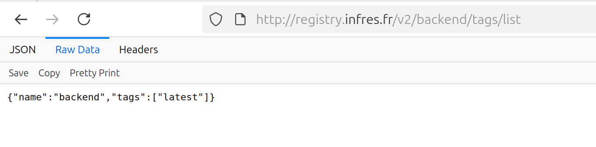

# Tp 1 Kubernetes Security

Nous avons commencé par créer un docker file pour chacun de nos services (frontend/backend) et nous avons ensuite mis à jour le docker-compose.yml 

Nous avons ensuite suivi toutes les étapes du tp jusqu'à l'étape du git compose push. 

Problème: Le push ne passe pas 

Après avoir identifié et corrigé un problème d'indentation dans le fichier /etc/rancher/k3s/registries.yaml, nous avons réussi à pousser les images vers le registrey.

Pour l'étape 4 du tp, nous avons commencé par créer un fichier myService.yaml regroupant les deux services frontend et backend

Problème: Après déploiement sur le cluster, nous n’avons pas pu accéder aux services. 

Message d’erreur rencontré lors de la tentative d’accès :

Le message d’erreur indiquait que le domaine demandé n’était pas reconnu. Nous avons donc ajouté l’adresse frontend.infres.fr dans le fichier vite.config.js du frontend.

Après cette modification, les services sont accessibles et fonctionnent correctement : 

